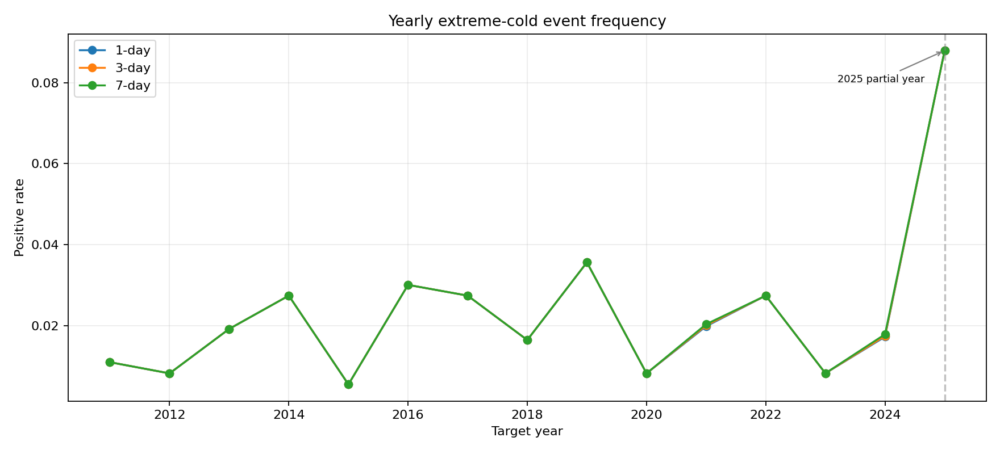
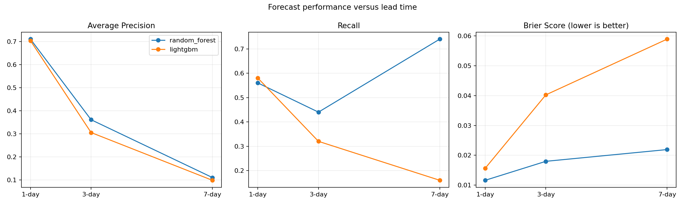
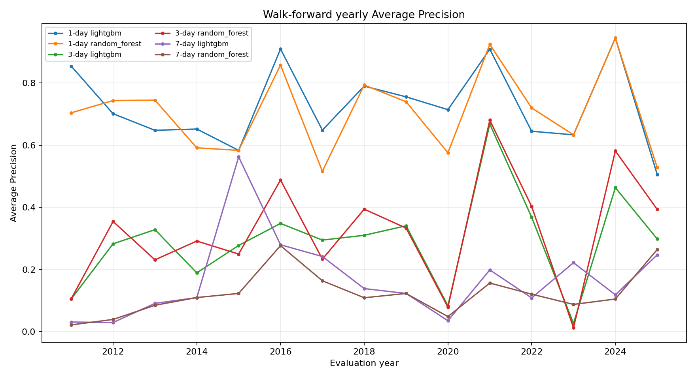
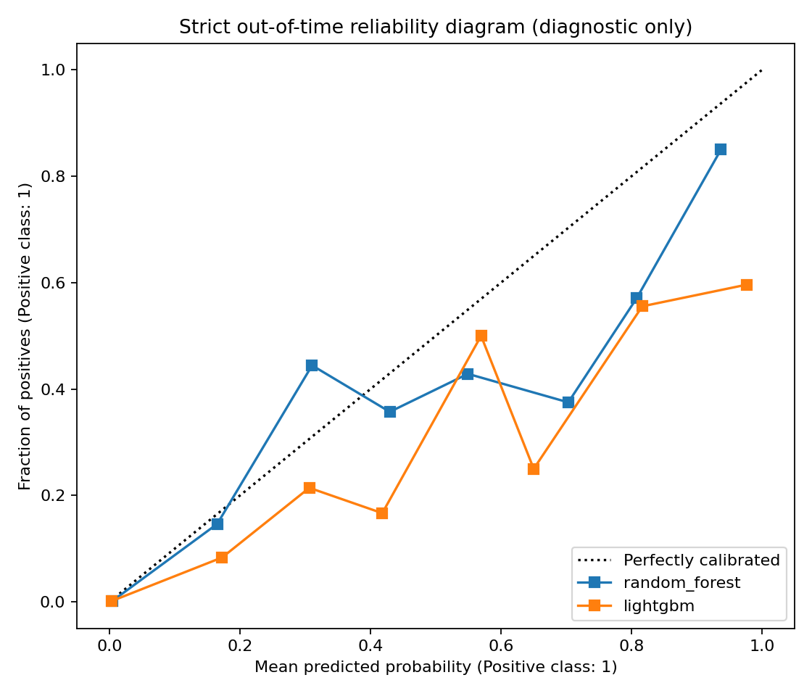

# Vancouver Extreme Cold Forecasting

A leakage-safe, multi-horizon extreme-cold forecasting project using daily GSOD observations from Vancouver International Airport. It reconstructs and audits a flawed undergraduate experiment, then evaluates 1-, 3-, and 7-day forecasts through a strict 2019-2025 holdout and expanding-window historical backtesting.

## Project focus

The project is intentionally about trustworthy temporal ML rather than model novelty:

1. Audit the original capstone for station mixing, ordering, sentinel values, broken windows, and model-selection leakage.
2. Build reproducible issue-time features that never use observations after prediction time.
3. Compare a Random Forest baseline with one restrained LightGBM challenger.
4. Select thresholds and models before touching the strict out-of-time test.
5. Backtest every target year using only data that would have been available then.

## Original problems found

- Rows from three weather stations were mixed before sliding-window construction.
- Dates were not globally ordered, and windows could cross stations or calendar gaps.
- GSOD sentinels (`9999.9` and `999.9`) were treated as real measurements.
- “Last 20%” was described as a 2019-2025 test despite the row order.
- The saved winner was selected using test AP.
- The original implementation did not define a reusable issue-date/target-date contract.

The original scores are therefore not treated as reproducible evidence.

## Leakage-safe forecast definition

For each horizon `h`, the pipeline builds:

```text
features available through issue date t  ->  extreme-cold label at t + h
```

The target is equivalent to `extreme_cold.shift(-h)`. Features contain the issue-day observation (`lag_0`), four earlier daily lags, trailing-only 5-day temperature statistics, an issue-time temperature trend, and issue-date seasonality. No centered rolling window, interpolation, backward fill, future station aggregation, or future-fitted preprocessing is used. Both the five-day history and the target date must be calendar-contiguous.

Returned sample dates are target dates. This ensures that a “2019 evaluation” means events occurring in 2019, while every corresponding issue date is earlier.

## Data and temporal design

- Station: `71892099999`
- Cleaned station rows: 17,708
- Observed period: 1957-01-06 to 2025-04-01
- Extreme-cold definition: daily minimum below 23°F (-5°C)
- Train: target dates through 2010-07-26
- Validation: 2010-07-27 through 2018-12-31
- Strict OOT test: 2019-01-01 through the horizon-specific final available target date
- Threshold: maximum F1 on Validation only
- Model selection: Validation AP only
- Final refit: all pre-2019 samples, after threshold and model selection

The test set is report-only. It never selects a model, threshold, hyperparameter, or calibrator.

### Extreme-cold event frequency



## Models

- Logistic Regression remains in the original 1-day compatibility report.
- Random Forest is the robust tree baseline.
- LightGBM 4.6 is the only modern challenger.

No XGBoost, CatBoost, tabular foundation model, neural network, Optuna HPO, or SHAP-heavy benchmark is included.

## Multi-Horizon Forecasting

Strict OOT results:

| Horizon | Model | Samples | Positive rate | Threshold | AP / PR-AUC | ROC-AUC | Precision | Recall | F1 | Brier |
|---|---|---:|---:|---:|---:|---:|---:|---:|---:|---:|
| 1 day | Random Forest | 2,253 | 2.22% | 0.689 | 0.711 | 0.989 | 0.718 | 0.560 | 0.629 | 0.0116 |
| 1 day | LightGBM | 2,253 | 2.22% | 0.926 | 0.704 | 0.990 | 0.644 | 0.580 | 0.611 | 0.0157 |
| 3 days | Random Forest | 2,245 | 2.23% | 0.264 | 0.361 | 0.930 | 0.333 | 0.440 | 0.379 | 0.0180 |
| 3 days | LightGBM | 2,245 | 2.23% | 0.892 | 0.305 | 0.936 | 0.421 | 0.320 | 0.364 | 0.0403 |
| 7 days | Random Forest | 2,232 | 2.24% | 0.080 | 0.110 | 0.900 | 0.107 | 0.740 | 0.187 | 0.0219 |
| 7 days | LightGBM | 2,232 | 2.24% | 0.699 | 0.098 | 0.890 | 0.107 | 0.160 | 0.128 | 0.0589 |



LightGBM had the highest Validation AP at all three horizons and is therefore the validation-selected artifact. The untouched test tells a more cautious story: Random Forest produced higher OOT AP and lower Brier at every horizon. This discrepancy is reported, not used to revise the selection rule.

Forecast difficulty rises sharply with lead time. Relative to the 1-day Random Forest AP, 3-day AP is 49% lower and 7-day AP is 85% lower. The 7-day RF recall is high only because its validation-selected threshold is very permissive; its 0.107 precision and low AP show that it is not a strong forecast.

| Horizon | Validation-selected model | Selected-model test AP | Recall | Brier |
|---|---|---:|---:|---:|
| 1 day | LightGBM | 0.704 | 0.580 | 0.0157 |
| 3 days | LightGBM | 0.305 | 0.320 | 0.0403 |
| 7 days | LightGBM | 0.098 | 0.160 | 0.0589 |

The 1-day task is the recommended headline task because it retains useful rare-event discrimination and the most stable yearly performance. The 3- and 7-day tasks are valuable stress tests of lead-time degradation, not equally deployable products.

## Walk-Forward Backtesting

The expanding-window backtest covers target years 2011-2025 for both models and all three horizons (90 model-year evaluations):

```text
train before evaluation year - 3 years
threshold validation = trailing 3 full/available years before evaluation
final fit = all target dates before evaluation year
evaluation = that year only
```

Preprocessing is refit inside every fold. The evaluation year is excluded from training and threshold selection. All 90 folds found both classes in their trailing validation period, so no fallback threshold was needed.



| Horizon | Model | Mean yearly AP | AP standard deviation | Mean recall | Mean Brier |
|---|---|---:|---:|---:|---:|
| 1 day | Random Forest | 0.707 | 0.136 | 0.655 | 0.0141 |
| 1 day | LightGBM | 0.726 | 0.131 | 0.578 | 0.0195 |
| 3 days | Random Forest | 0.322 | 0.182 | 0.271 | 0.0203 |
| 3 days | LightGBM | 0.293 | 0.157 | 0.413 | 0.0489 |
| 7 days | Random Forest | 0.123 | 0.072 | 0.522 | 0.0228 |
| 7 days | LightGBM | 0.169 | 0.136 | 0.569 | 0.0622 |

Yearly metrics are high-variance because most years contain only 2-13 events. The weakest 3-day year was 2023 (three positives; AP 0.013 RF and 0.027 LightGBM). The highest 1-day AP was 0.944 for both models in 2024. The 2025 evaluation contains only 91 target days through April 1 and is retained but marked as a partial year; it is excluded from annual drift slopes.

Across complete years, 1-day AP did not show temporal degradation: the fitted AP slope was +0.0086/year for RF and +0.0056/year for LightGBM. Recent five-year mean temperature was only moderately higher than the first five backtest years (+0.32 standardized units), while mean minimum temperature was essentially unchanged. These simple diagnostics do not establish a climate trend; they indicate no obvious performance collapse in this station-level backtest.

## Probability quality

No probability calibrator is fitted. Reliability diagrams are diagnostic only, and Brier score evaluates raw probabilities. A fitted calibrator would require a separate untouched pre-test calibration period and would materially change the established baseline.



## Run

Place the workbook at `data/raw/1957-2025.xlsx`, then:

```bash
uv sync --extra dev
uv run cold-events --data data/raw/1957-2025.xlsx --output artifacts
uv run pytest -q
uv run ruff check .
uv lock --check
```

Use `--skip-backtest` for a faster horizon-only run.

## Artifacts

- `metrics.json`, `model.joblib`, `calibration.png` - backward-compatible 1-day outputs
- `horizon_metrics.json`, `model_h1.joblib`, `model_h3.joblib`, `model_h7.joblib`
- `horizon_performance.png`
- `walk_forward_metrics.csv`
- `walk_forward_ap.png`, `walk_forward_recall.png`
- `positive_event_frequency.png`
- `temporal_drift.json`

## Responsible interpretation

This is reasonably described as a historical multi-horizon forecasting system: every prediction has an explicit issue date, future target date, temporal-safe threshold, and deployment-style backtest. It is not an operational weather service. A deployable 3- or 7-day system should incorporate predictors available at issuance such as NWP forecast fields, spatial validation, uncertainty analysis, and monitoring for station or climate regime changes.

## Repository map

```text
src/cold_events/data.py          station contract and GSOD sentinel cleaning
src/cold_events/features.py      issue-time multi-horizon feature/target construction
src/cold_events/modeling.py      compatibility benchmark and model definitions
src/cold_events/backtesting.py   horizon benchmark, walk-forward folds, drift and plots
tests/                           data, target-horizon, split and threshold-leakage tests
.github/workflows/ci.yml         locked-environment lint and test automation
```

## Original work

This repository is a portfolio-grade reconstruction of a Spring 2025 environmental science capstone. The thesis PDF can be linked from a GitHub Release or a `docs/` folder if institutional sharing is permitted.
